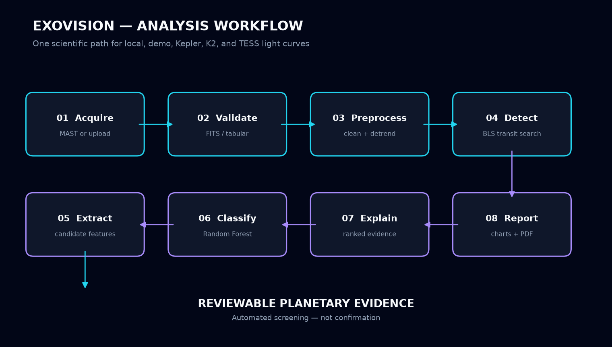
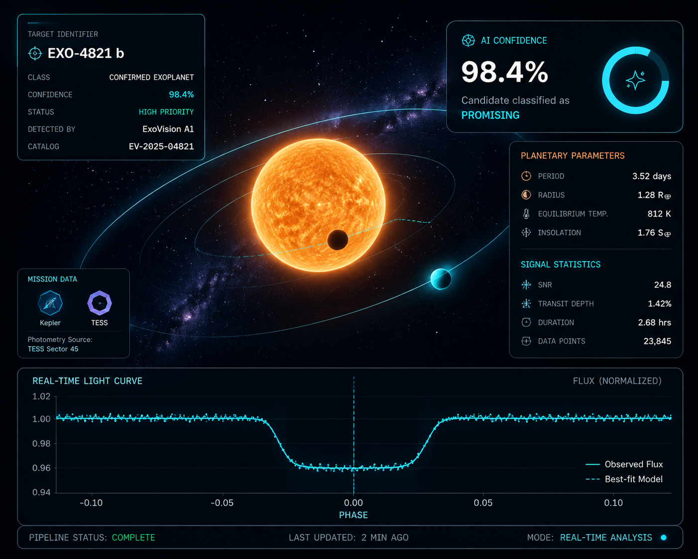

# ExoVision AI

### AI-assisted exoplanet candidate screening platform

ExoVision AI turns NASA and user-supplied stellar light curves into explainable exoplanet-candidate screening assessments. It combines real light-curve preprocessing and Box Least Squares transit detection with Random Forest classification and evidence-rich scientific reports.


## Overview

ExoVision provides one coherent path from raw photometry to reviewable evidence. A user can create an account, upload a FITS/CSV/TXT light curve or select a public Kepler/TESS observation, run the[...]

The project is designed as a portfolio-ready scientific software system: the AI modules are framework-independent, the REST API enforces ownership, and the product interface exposes the analysis w[...]

## Problem Statement

Transit surveys measure tiny, periodic drops in stellar brightness. Real observations contain instrument systematics, stellar variability, missing samples, noise, and astrophysical false positives[...]

## Solution

ExoVision connects NASA MAST and local observations to a reusable astronomy pipeline. Box Least Squares locates periodic transit-like signals; candidate diagnostics feed a trained Random Forest cl[...]

## Features

- Responsive futuristic astronomy landing page
- JWT authentication with Argon2 password hashing
- FITS, CSV, and TXT light-curve uploads
- Guided demo using a bundled deterministic transit
- NASA MAST search for Kepler, K2, and TESS products
- Box Least Squares transit detection and phase folding
- Random Forest multiclass candidate classification
- Explainable evidence and feature-importance visualization
- Raw and phase-folded interactive charts
- Owned analysis history and report library
- Automated scientific PDF generation
- OpenAPI documentation, deployment manifests, and migration paths

## Architecture


```text
NASA Kepler/TESS Data
        ↓
FITS Processing
        ↓
Light Curve Preprocessing
        ↓
BLS Transit Detection
        ↓
Feature Extraction
        ↓
Machine Learning Classification
        ↓
Explainable AI
        ↓
Scientific Report
```

See [system architecture](docs/architecture.md) for component boundaries, ownership, persistence, and data flow.

## AI Pipeline

1. **Load and validate** Kepler/TESS-compatible FITS or tabular `time`/`flux` data.
2. **Preprocess** finite samples with normalization, transit-safe outlier handling, and detrending.
3. **Detect** periodic box-shaped signals using Astropy Box Least Squares.
4. **Fold and extract** period, epoch, duration, depth, SNR, repeatability, symmetry, and false-positive diagnostics.
5. **Classify** candidates with the trained Random Forest model.
6. **Explain** the prediction using ranked model importance plus documented domain-direction rules.
7. **Report** measurements, plots, classification, evidence, and scientific caveats as PDF.



## Technology Stack

| Layer | Technology |
| --- | --- |
| Frontend | Next.js 16, React 19, TypeScript, Tailwind CSS, Framer Motion |
| Backend | FastAPI, Pydantic, Uvicorn, JWT, Argon2 |
| Astronomy | Astropy, Lightkurve, NumPy, SciPy, Pandas |
| Machine learning | scikit-learn Random Forest, Joblib |
| Visualization | React chart components, Matplotlib, ReportLab |
| Persistence | SQLite locally; PostgreSQL-compatible production schema |
| Data | NASA MAST, Kepler, K2, TESS, user light curves |
| Deployment | Vercel frontend; Render/Railway backend manifests |

## Dataset Sources

- **NASA Kepler** long-baseline precision photometry
- **NASA K2** ecliptic-plane campaigns
- **NASA TESS** sector-based all-sky observations
- **User data** in FITS, CSV, or TXT format
- **Bundled demo** at `data/samples/exoplanet_demo_transit.fits`

NASA results are resolved and retrieved through the public MAST API. Archive files enter the same upload and analysis path as local data.

## Screenshots

Below are curated, production-style screenshots that showcase the ExoVision UI and the outputs it produces during a typical analysis.

### Landing Page

A welcoming, responsive landing experience that introduces the product and provides quick access to demo and sign-in flows.


### Dashboard

The primary workspace shows owned analyses, quick actions (upload, demo, search MAST), and recent activity.


### Analysis Results

Phase-folded and raw light-curve visualizations, detection metrics, and candidate summaries are presented together for rapid triage.



### Explainable AI

Feature importance, rule-based evidence, and annotated diagnostics that justify the model's classification for each candidate.


### PDF Report

Automated, publication-quality PDF reports that compile measurements, plots, classifications, and caveats for sharing and archiving.


## Demo

After signing in, open `/demo` and select **Run sample analysis**. ExoVision downloads the repository's deterministic FITS sample, submits it to the standard upload endpoint, detects its known 5-[...]

## Installation

Requirements: Python 3.12 and Node.js 20.9 or newer.

```powershell
git clone <repository-url>
Set-Location "ExoVision AI"
py -3.12 -m venv .venv
.venv\Scripts\Activate.ps1
python -m pip install -r requirements.txt
Copy-Item .env.example .env
Set-Location backend
uvicorn app.main:app --reload --port 8000
```

Start the frontend in another terminal:

```powershell
Set-Location frontend
npm ci
Copy-Item .env.example .env.local
npm run dev
```

Open `http://localhost:3000`. Configure a stable `JWT_SECRET` of at least 32 bytes before using persistent accounts or deploying.

Production environment and provider instructions are in [deployment.md](docs/deployment.md).

## API Documentation

With the backend running:

- Swagger UI: `http://localhost:8000/docs`
- ReDoc: `http://localhost:8000/redoc`
- OpenAPI JSON: `http://localhost:8000/openapi.json`
- Health: `http://localhost:8000/api/v1/health`

Core flow:

```text
POST /api/v1/auth/register
POST /api/v1/upload/lightcurve
POST /api/v1/analyze/{analysis_id}
GET  /api/v1/results/{analysis_id}
POST /api/v1/reports/{analysis_id}
GET  /api/v1/reports/{analysis_id}/download
```

See [API documentation](docs/api.md) for all authentication, upload, analysis, result, report, model, and dataset endpoints.

## Future Improvements

- Implement the runtime PostgreSQL repository adapter for horizontal scaling
- Move FITS uploads and reports to object storage
- Add asynchronous analysis workers for large survey batches
- Calibrate classifier probabilities on a larger labeled catalog
- Add established astrophysical vetting such as centroid and contamination checks
- Expand observability, rate limiting, and automated deployment smoke tests

## License

MIT. See [LICENSE](LICENSE).

> **Scientific disclaimer:** ExoVision produces automated screening evidence, not confirmed discoveries. Validation requires independent review, systematics assessment, follow-up observations, an[...]
