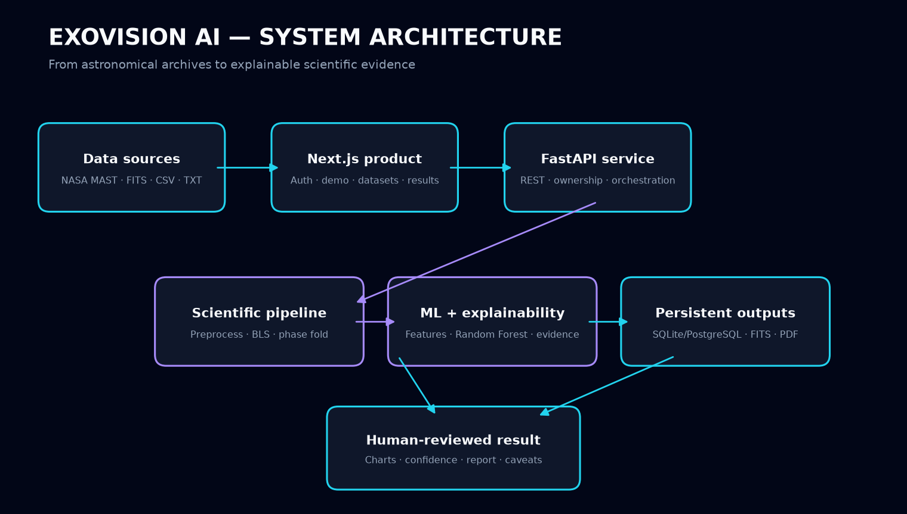

# ExoVision AI architecture

ExoVision AI is a three-layer application: a Next.js client, a versioned FastAPI service, and a reusable scientific Python pipeline. API services orchestrate scientific modules; they do not duplicate detection or classification logic.



## Frontend

The `frontend/` application uses Next.js 16 App Router, strict TypeScript, Tailwind CSS, Framer Motion, and client-side chart components. `AuthContext` stores the bearer token and resolves the active user. `frontend/src/lib/api.ts` is the single HTTP boundary for authentication, upload, analysis, results, reports, demo data, and NASA datasets.

Public routes are `/`, `/auth/login`, and `/auth/signup`. Product routes use `ProtectedRoute`: `/dashboard`, `/upload`, `/demo`, `/datasets`, `/results/[id]`, and `/reports`.

## Backend

The `backend/app/` FastAPI application exposes `/api/v1` endpoints and OpenAPI documentation at `/docs`, `/redoc`, and `/openapi.json`. Route modules validate HTTP contracts; service modules own orchestration; repositories own persistence and authorization lookups.

Uploads and generated reports are stored outside the source tree using `UPLOAD_ROOT` and `REPORT_ROOT`. Each analysis directory contains an immutable source light curve, status metadata, and the completed scientific result.

## AI pipeline

```text
NASA Kepler/TESS data or user upload
                  ↓
          FITS/CSV/TXT loader
                  ↓
       validation and preprocessing
                  ↓
        Box Least Squares search
                  ↓
   phase folding + candidate extraction
                  ↓
          ML feature engineering
                  ↓
       Random Forest classification
                  ↓
 evidence explanation + scientific PDF
```

The `ai/` package is framework-independent. `AnalysisService` loads observations and invokes `analyze_lightcurve`; `MLInferenceService` applies the trained classifier and domain-direction explanation rules. Detection parameters and algorithms remain isolated from the web layer.

## Database

SQLite is the supported local and single-instance deployment database. Embedded migrations run at API startup and create `users`, `datasets`, `analyses`, `candidates`, and `reports` plus query-oriented indexes. Foreign keys enforce ownership and cascade cleanup from users to analyses and from analyses to candidates and reports.

`backend/migrations/postgresql/0001_initial.sql` provides the production PostgreSQL schema with equivalent relationships, UTC-aware timestamps, indexes, and confidence constraints. Moving the runtime repositories to PostgreSQL requires a PostgreSQL driver or ORM adapter; SQLite remains active until that adapter is configured. Binary FITS and PDF data should remain in persistent object/disk storage, with only metadata in PostgreSQL.

## Data flow

1. A user authenticates and uploads a local file, starts the bundled demo, or selects a MAST product.
2. External datasets are proxied as FITS and submitted through the normal upload contract.
3. The backend creates an owned analysis record and stores the source safely.
4. SQLite atomically claims an uploaded analysis as `processing` so duplicate requests cannot execute it again.
5. A FastAPI in-process background task runs the existing preprocessing, BLS, candidate, ML, and explainability pipeline.
6. The browser polls persisted backend status and resumes that view after refresh; completed results are then projected into bounded visualization arrays.
7. The report service renders the same persisted result into an authenticated PDF download.

## Security and operational boundaries

- Passwords are Argon2-hashed; API sessions use signed, expiring JWTs.
- Every analysis, result, and report request verifies resource ownership.
- Upload extensions, names, sizes, and identifiers are validated.
- CORS is allowlisted through `BACKEND_CORS_ORIGINS`.
- NASA traffic is limited to public MAST endpoints and validated `mast:` product identifiers.
- A BLS/ML candidate is screening evidence, not scientific confirmation.
- Background execution is intentionally scoped to the current single-instance portfolio deployment. It is not a durable distributed queue; process termination can interrupt active analyses, and multi-instance scale requires dedicated worker infrastructure.
