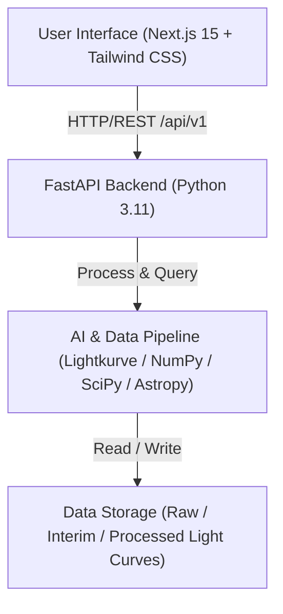

# ExoVision AI System Architecture (Phase 1)

## Overview

ExoVision AI is a high-performance full-stack platform designed to analyze astronomical light curves for exoplanet transit signatures. Phase 1 establishes a modular, decoupled base architecture featuring a Next.js frontend, a Python FastAPI microservice, and a decoupled AI data engineering package.

---

## High-Level Architecture Diagram

---

## Component Breakdown

### 1. Frontend (`frontend/`)
- **Framework**: Next.js 15 with App Router and TypeScript.
- **Styling**: Tailwind CSS with a custom dark theme palette optimized for astronomical data visualization.
- **Role**: Renders modern user interface, light curve visualizer dashboards, transit detection candidate status, and telemetry.

### 2. Backend (`backend/`)
- **Framework**: Python 3.11 with FastAPI.
- **Routing**: API v1 versioned endpoints (`/api/v1/health`, upload routes, detection handlers).
- **CORS**: Configured to restrict access to authorized origins (`http://localhost:3000`).
- **Role**: Provides RESTful APIs, request validation via Pydantic schemas, and orchestration between frontend requests and AI processing pipelines.

### 3. AI & Data Pipeline (`ai/`)
- **Core Packages**: `lightkurve`, `astropy`, `scipy`, `pandas`, `numpy`, `scikit-learn`, `matplotlib`.
- **Modules**:
  - `preprocessing`: Outlier removal, detrending, and flux normalization.
  - `features`: Periodograms (BLS/TLS), transit depth calculation, and duration metrics.
  - `detection`: Signal detection algorithms and candidate scoring.
  - `experiments` & `evaluation`: Model training routines and benchmark metrics.
  - `visualization`: Interactive and static diagnostic plot generation.

### 4. Data Layout (`data/`)
- `raw/`: Unprocessed FITS files and light curve streams from Kepler, K2, and TESS missions.
- `interim/`: Flattened, detrended, and normalized light curve arrays.
- `processed/`: Folded phase light curves, candidate feature vectors, and classification outputs.
- `metadata/`: Target star catalogs (TIC, KIC IDs), stellar parameters (mass, radius, effective temp), and label mappings.
