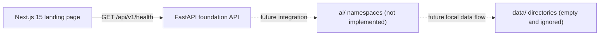

# ExoVision AI system architecture (Phase 1.1)

## Current architecture

Phase 1.1 establishes independently testable frontend and backend applications
plus empty package boundaries for future scientific work.

## Components

### Frontend (`frontend/`)

- Next.js 15 App Router under `src/app`
- Strict TypeScript configuration
- Tailwind CSS responsive landing page
- Client-side API health indicator using `NEXT_PUBLIC_API_URL`

The cards describe planned product capabilities; there are no upload,
detection, or candidate-analysis flows in Phase 1.1.

### Backend (`backend/`)

- Application factory and FastAPI entry point in `app/main.py`
- Versioned router in `app/api/v1/router.py`
- Environment-backed settings in `app/config/settings.py`
- Pydantic response contract in `app/schemas/health.py`
- CORS restricted by default to `http://localhost:3000`
- Only read-only system endpoints are implemented

FastAPI's standard validation and HTTP error responses are sufficient for the
two current endpoints. Domain-specific exception handlers should be added only
when domain operations exist.

### AI workspace (`ai/`)

Importable namespaces reserve boundaries for preprocessing, feature extraction,
detection, evaluation, experiments, visualization, utilities, and tests. They
contain no algorithms, dependencies, datasets, or models in Phase 1.1.

### Data and model workspaces

`data/` contains empty raw, interim, processed, sample, and metadata locations.
`models/` is an empty artifact location. Git tracks only placeholder files in
these directories; generated content is ignored.
